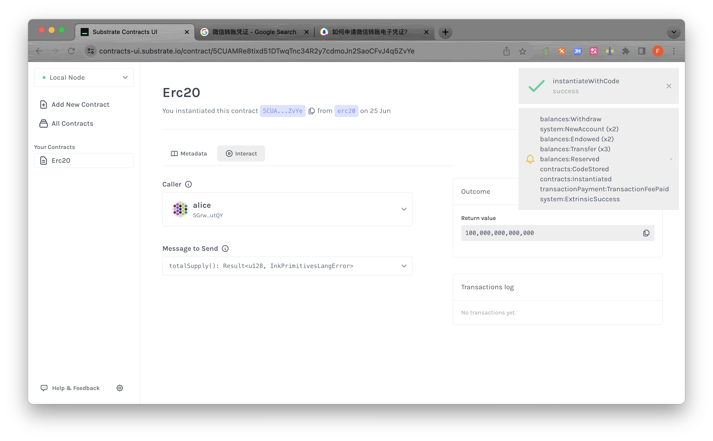
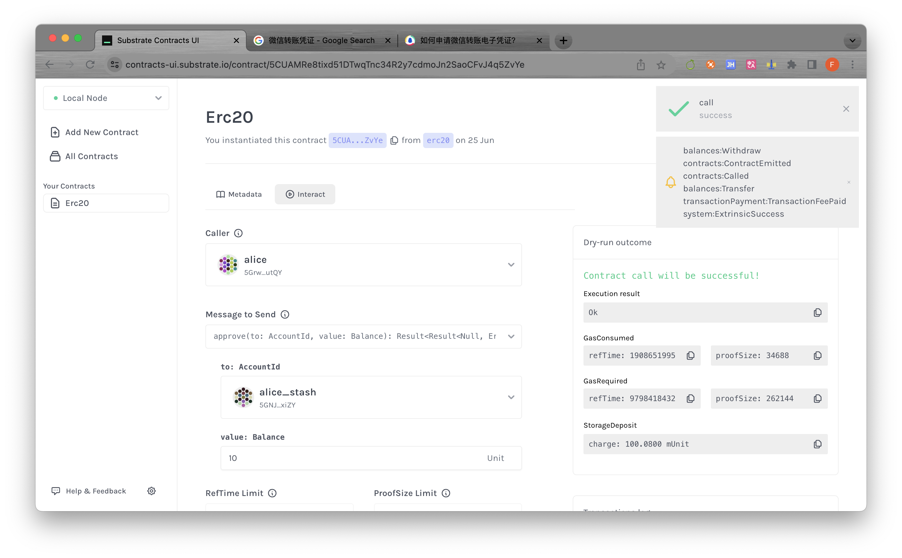
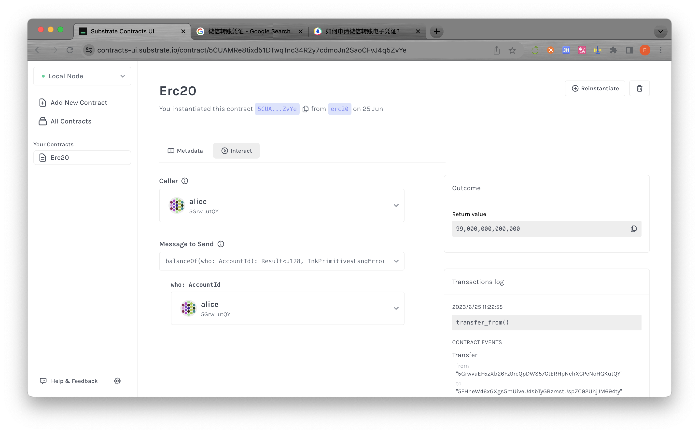
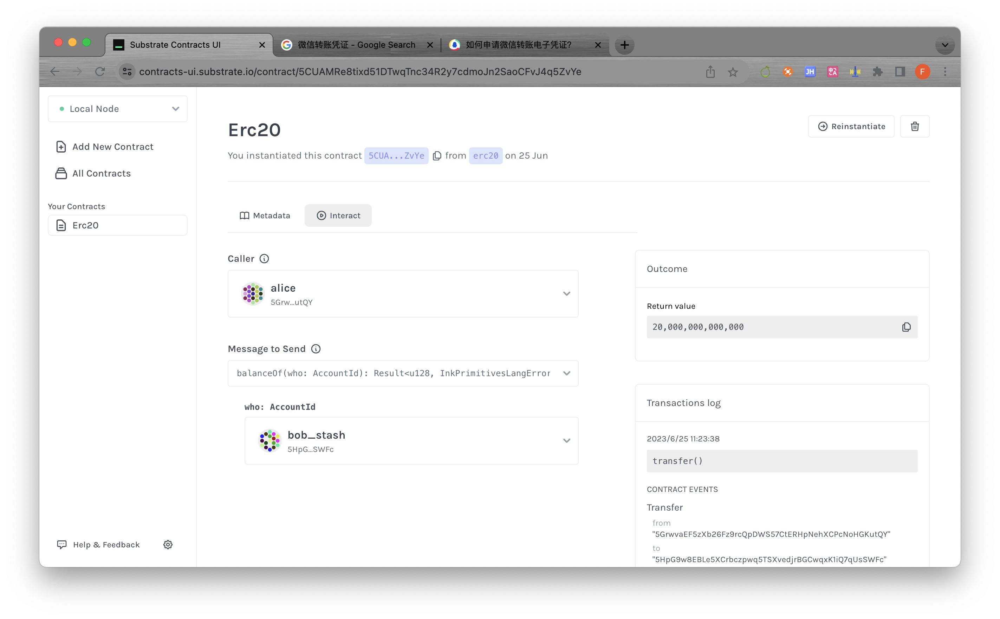
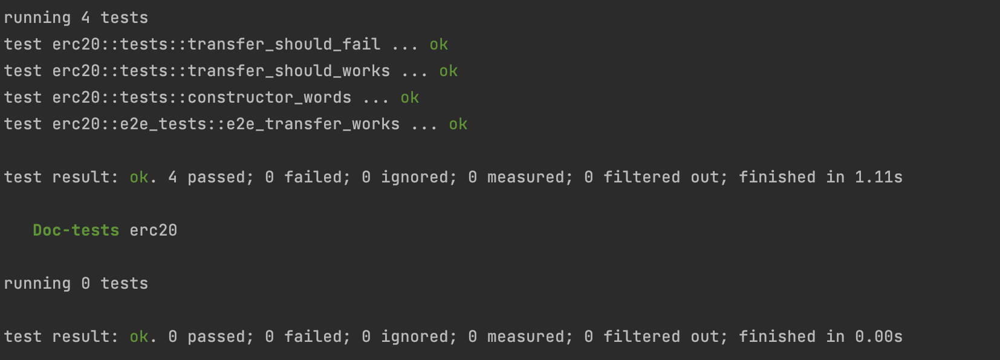

## 第五次课，ERC20实现、部署

### 部署

### approve and transfer_from

| 步骤                  | 结果                                    |
|---------------------|---------------------------------------|
| approve             |              |
| check_approve       |        |
| transfer_from       |        |
| check_transfer_from |  |
| check_approve_2     |      |

### transfer

| transfer                    | 查看transfer之后的结果             |
|-----------------------------|-----------------------------|
|  |  |

### test/e2e-test

